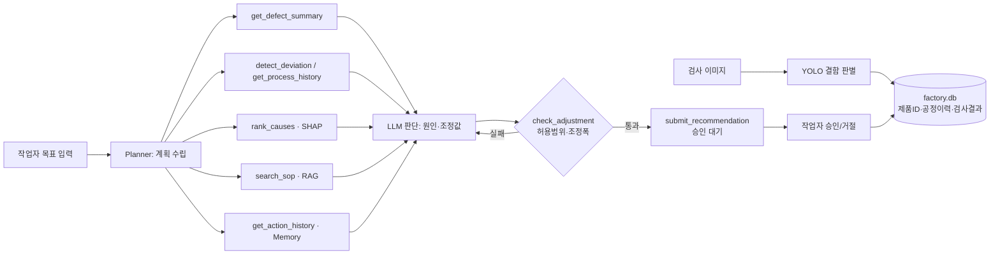

# D1~2 범위 확정서 (Promptors)

## 문제정의 (1문장)
열연 강판 공장에서 표면 결함이 급증해도 **어느 공정의 어떤 설정값 때문인지** 찾는 데 숙련자가 수 시간을 쓰는 문제를,
AI Agent가 결함 판별 → 원인 공정·변수 역추적 → 안전한 조정값 제안까지 수 분 안에 처리하도록 돕는다.

## Agent 역할 (1문장)
비전 AI의 결함 판정과 공정 이력을 결합해 원인을 스스로 조사하고, 작업표준서·설비 허용범위 안에서 조정값을 근거와 함께 제안하는 품질 원인추적 Agent.

## 핵심기능 (4개로 고정)
| # | 기능 | 구현 | 담당 |
|---|---|---|---|
| 1 | 결함 판별 | YOLO11 전이학습(NEU-DET 6종), 결함 유형·위치(bbox) | 유동현 |
| 2 | 원인 추적 | 결함-공정이력 결합, 이탈 탐지, SHAP 원인 순위 | 김동환 |
| 3 | Agent 조언 | Claude + LangChain tool calling, SOP RAG, 허용범위 검증 | 김동환·김승록 |
| 4 | 승인·이력 + 대시보드 | 승인 대기 → 작업자 승인/거절 → 이력(Memory), Streamlit | 김승록 |

## 제외범위 (이번 대회에서 안 만드는 것)
회원가입/권한, 메신저 알림, MLflow·ONNX 자동화, 실설비 연동, 별도 이상탐지 히트맵 모델, 자연어 Q&A(시간 남으면 추가)

## 시연 성공조건 (반드시 성공해야 하는 한 장면)
스크래치 급증 시나리오 재생 → Agent가 계획을 말하고 → 도구 호출 로그가 보이고 →
원인 1순위 "사상압연 출측 속도"를 SHAP 근거와 함께 제시 → 목표값이 1회 조정폭을 넘자 **스스로 안전값으로 수정**(Feedback) →
승인 대기 등록 → 작업자 승인 → 다음 실행 때 이력을 참고(Memory)

## Agent Workflow

## Agent 6요소 대응
| 요소 | 구현 위치 |
|---|---|
| Goal | 작업자 자연어 목표 입력 (`run_demo.py --goal`) |
| Planning | 시스템 프롬프트 규칙 1: 도구 호출 전 계획 출력 → 로그 `think` |
| Reasoning | 결함 유형·이탈 결과에 따라 조사할 변수·조치(조정 vs 상류 통보) 선택 |
| Tool Use | `agent/tools.py` 8개 도구 |
| Memory | `actions` 테이블 + `get_action_history` |
| Feedback | `check_adjustment` 실패 → safe_value로 재검증, LLM 실패 → Fallback 플래너 |

## 예상 오류와 대응
1. **LLM API 장애/지연** → 같은 도구를 쓰는 규칙 기반 Fallback 플래너로 자동 전환 (구현 완료)
2. **YOLO 오판(정상↔결함, 유형 혼동)** → conf 임계값 조정, 원인분석은 표본 10건 미만이면 "신뢰도 낮음" 반환 (구현 완료)
3. **원인 후보가 조정 불가 변수(개재물 등)** → 조정 대신 로트 보류·제강 통보 제안 (구현 완료)

## 열린 이슈 (팀 결정 필요)
- **신청분야**: 신청서는 "2. 업무혁신"에 체크됨 → 사무국에 3번(제조 피지컬) 변경 가능 여부 확인
- **정상 이미지 부재**: NEU-DET은 전부 결함 이미지 → 정상 제품은 현재 "이미지 없음 통과" 처리. 정상 판정 시연이 필요하면 별도 데이터 확보 필요
- **평가 난이도**: 현재 시뮬레이션은 에피소드당 변수 1개만 이탈해서 원인 추적이 너무 쉬움(12/12 정답). D5에 동시 이탈·잡음 시나리오 추가
